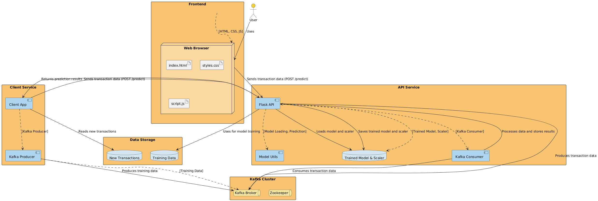

# Credit Card Fraud Detection System

This application is designed to detect and prevent fraudulent activities in credit card rewards data. By leveraging machine learning techniques, this system analyzes transaction data to identify patterns and anomalies indicative of fraud. Also includes components for training the model, making predictions via an API, batch processing, and real-time processing using Kafka.

## Table of Contents
- [System Architecture](#system-architecture)
- [Project Structure](#project-structure)
- [Setup and Installation](#setup-and-installation)
  - [Clone the repository](#clone-the-repository)
  - [Prerequisites](#prerequisites)
  - [Running Locally Without Docker](#running-locally-without-docker)
  - [Running with Docker](#running-with-docker)
- [Model Training and Selection](#model-training-and-selection)
- [Usage](#usage)
  - [API Endpoints](#api-endpoints)
  - [Batch Processing](#batch-processing)
  - [Kafka Integration](#kafka-integration)
- [Frontend Interface](#frontend-interface)
- [Contributing](#contributing)
- [License](#license)

## System Architecture

**Figure 1**: System Workflow integrating Kafka, Dockerized models, and Flask APIs for real-time fraud detection.

## Project Structure
```
Faud-detection-system/
├── api/
│   ├── app.py
│   ├── kafka_consumer.py
│   ├── model.pkl
│   ├── scaler.pkl
│   ├── requirements.txt
│   ├── Dockerfile.api
├── client/
│   ├── kafka_producer.py
│   ├── client_app.py
│   ├── requirements.txt
│   ├── new_transactions.csv
│   ├── Dockerfile.client
├── frontend/
│   ├── index.html
│   ├── styles.css
│   ├── script.js
│   ├── Dockerfile.frontend
├── dataset/
│   ├── creditcard_2023.csv
├── README.md
├── docker-compose.yml
├── model_training.py
├── requirements.training.txt
├── nginx.conf

```
## Setup and Installation

### Clone the repository
   ```bash
   git clone https://github.com/shipra-aeron/Fraud-Detection-System.git
   cd Fraud-Detection-System
   ```

### Prerequisites
- Python 3.8+
- Docker and Docker Compose
- Kafka


### Running Locally Without Docker

For detailed steps to run the application locally without Docker, please refer to [README_LOCAL.md](docs/README_LOCAL.md).

### Running with Docker

For detailed steps to run the application using Docker, please refer to [README_DOCKER.md](docs/README_DOCKER.md).

## Model Training and Selection

For an in-depth explanation of the thought process behind model training and selection, please refer to [MODEL_TRAINING_AND_SELECTION.md](docs/MODEL_TRAINING_AND_SELECTION.md).

## Usage

### API Endpoints

The Flask API provides several endpoints for making predictions and managing transactions.

**POST /predict**
  - **Description**: Accepts transaction data and returns a prediction.
  - **Sample Request**:
    ```json
    {
      "transaction_id": "12345",
      "amount": 200.0,
      "time": 56789,
      "v1": 0.5,
      "v2": -1.2,
      "v3": 0.8
    }
    ```
  - **Sample Response**:
    ```json
    {
      "prediction": "fraud",
      "confidence": 0.92
    }
    ```

### Batch Processing

You can process batches of transactions by running the `client_app.py` script. This script reads transactions from `new_transactions.csv` and sends them to the API for predictions.

### Kafka Integration

The system uses Kafka for real-time processing of transaction data. The Kafka producer (`kafka_producer.py`) sends messages to a Kafka topic, and the Kafka consumer (`kafka_consumer.py`) processes these messages and interacts with the API.

## Frontend Interface

The frontend interface allows users to interact with the system via a web browser. The frontend is served using a simple HTTP server and communicates with the API for predictions.

## Contributing

Contributions are welcome! Please submit a pull request or open an issue to discuss any changes.

1. Fork the repository.
2. Create a new branch for your feature/bugfix.
3. Submit a pull request.

## Future Work
1. Unsupervised Learning:
Explore clustering techniques for detecting novel fraud patterns.
2. Geospatial Analysis:
Integrate location data for enhanced fraud detection.


## License

This project is licensed under the MIT License. See the [LICENSE](LICENSE) file for more details.